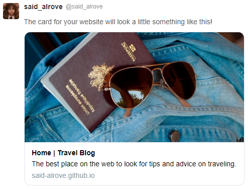

# travel-blog
The second project from Juan Pablo's course of CSS Grid and Flexbox. 

## Project's preview

## What I Learned
I figured out how to use the images in the web correctly by using things like the srcset attribute in either the img or source elements, and in like manner now I know that I was doing the fallback for images with different formats wrongly due to I was using the same image with different formats in the same srcset element (that makes that the browser would only read the first image in the source element, and if it's supported it'd use it, if not, the fallback would have failed), for instance:

        <picture>
            <source srcset="01.webp, 01.avif,">
            
        </picture>
        
When I should've been specifying the image formats separately, like this:

        <picture>
            <source type="image/webp" srcset="02.webp">
            <source type="image/avif" srcset="02.avif">
            
        </picture>
        
That way the browser can perfectly understand the whole fallback. If the browser doesn't support the first image format, it goes to the second format if it's possible, if not, it returns to the img original source. If you want more information you can check the following links that helped me to understand this whole idea:

   1.- [Srcset and sizes attributes](https://www.youtube.com/watch?v=2QYpkrX2N48&t=1s). 
  
   2.- [When to use .jpg or .png? the answer is WebP... sort of](https://www.youtube.com/watch?v=Z_28syzkv-0).
  
   3.- [The HTML picture element explained](https://www.youtube.com/watch?v=Rik3gHT24AM&t=1025s). 
 
I have to mention that I've already talked about these videos in the [easy recipe](https://github.com/said-alrove/easy-recipe) project, but there was something left, and that's the type attribute for specifying the format of the set of images, and for that [this other video](https://www.youtube.com/watch?v=rO6rvbN37ZA) gave me a hand for somethign I took for granted.

But, why .avif and not other formats? Well that's because what I'm looking for, is a better performance for the users, and the images play a huge role when loading a site, therefore I obviously decided to use the .webp format as always, but furthermore, I figured out that there was a lighter format with great quality too, unfortunately, it doesn't have enough support yet (60-70 percent maybe) so I thought It'd be a great opportunity for using both formats by creating fallbacks, which was a little hard because how I mentioned before, I didn't know how to make the fallback correctly.

If you want to learn more about what's the .avif format check these videos out:

   1.- [¿Qué es AVIF?](https://www.youtube.com/watch?v=32cDac99c04) - It's in Spanish.
   
   2.- [The AVIF Image Format by Kornel Lesiński [ IMAGE READY ]](https://www.youtube.com/watch?v=VHm5Ql33JYw).
   
As the last thing, I have to mention that I got an 89 score in the accessibility section in the lighthouse report due to I didn't contrast good enough the secondary color (yellow) with the letters (white) and also because the social media menu didn't have "some descriptive text" in it (the menu was made with icons, thus I didn't use text in the links).

That'd be everything for this project :D.

### Lighthouse

### Facebook

### Twitter

